# 上位机需求说明
## 通信建立
设置好本机IP为`192.168.1.xx`, 上位机作为TCP客户端，输入机械臂的IP地址(`192.168.1.200`)和端口号(`8899`)连接机械臂，机械臂作为TCP服务器，端口号为`8899`.

    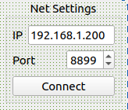

点击`Connect`后, 连接成功则提示成功信息，否则提示连接失败，当连接断开时也要提示连接未连接信息

    

连接成功时按钮变为`disconnect`; 连接失败时按钮变为`connect`, 默认为`connect`.

## 控制
### 正运动
* 给定六个关节位置J1~J6, slider的范围将当前J3的-90~90改为-75~75，其他值不变，默认值均为0；
* 在拖动过程中, 将机械臂目标状态实时显示出来，点击[这里](#arm_show)跳转到具体显示说明
* 点击确认按钮OK后，将这六个值发送给机械臂

    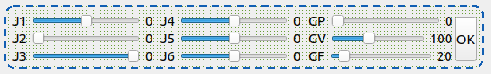

* 发送协议为

    | data[0] | data[1] | data[2] | data[3] | data[4] | data[5] | data[6] |
    |  :---:  |  :---:  |  :---:  |  :---:  |  :---:  |  :---:  |  :---:  |
    | 1145(head) |  joint1 |  joint2 |  joint3 |  joint4 |  joint5 |  joint6 |
### 逆运动
* 第一个Tab为机械臂平移指令，依次为"z pos + value", "x pos + value", "z pos - value", "y pos - value", "y pos + value", "x pos - value"
* 第二个Tab为机械臂旋转指令，依次为"z rot + value", "x rot + value", "z rot - value", "y rot + value", "y rot - value, " x rot - value"
* 在点击时出现点击特效(在本例中，点击时晕染为黄色，松开后晕染恢复为灰色)

    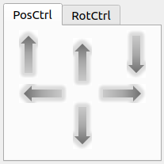
    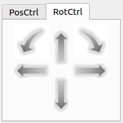
    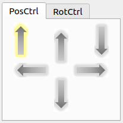
    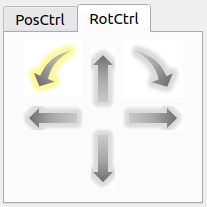

* 点击时提示已发送的信息
  

    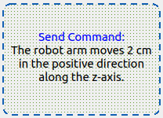
    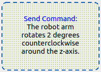
  

* 发送协议为
  
    * 短按: pos平移的value单位为cm, 暂定为1, rot旋转的value单位为度，暂定为1

    | data[0] | data[1] | data[2] | data[3] |   Operation   |
    |  :---:  |  :---:  |  :---:  |  :---:  |     :---:     |
    |  0x01   |  0x01   |   0x00  |  value  | z pos - value |
    |  0x01   |  0x01   |   0x01  |  value  | z pos + value |
    |  0x01   |  0x02   |   0x00  |  value  | z rot - value |
    |  0x01   |  0x02   |   0x01  |  value  | z rot + value |
    |  0x02   |  0x01   |   0x00  |  value  | x pos - value |
    |  0x02   |  0x01   |   0x01  |  value  | x pos + value |
    |  0x02   |  0x01   |   0x00  |  value  | x rot - value |
    |  0x02   |  0x01   |   0x01  |  value  | x rot + value |
    |  0x03   |  0x01   |   0x00  |  value  | y pos - value |
    |  0x03   |  0x01   |   0x01  |  value  | y pos + value |
    |  0x03   |  0x02   |   0x00  |  value  | y rot - value |
    |  0x03   |  0x02   |   0x01  |  value  | y rot + value |

    * 长按: 长按机械臂进入Cartesian Space运动模式，末端执行器**持续**沿箭头方向平移或旋转

    | data[0] | data[1] | data[2] | data[3] |   Operation   |
    |  :---:  |  :---:  |  :---:  |  :---:  |     :---:     |
    |  0x04   |  0x01   |   0x00  |  value  |    z pos--    |
    |  0x04   |  0x01   |   0x01  |  value  |    z pos++    |
    |  0x04   |  0x02   |   0x00  |  value  |    z rot--    |
    |  0x04   |  0x02   |   0x01  |  value  |    z rot++    |
    |  0x05   |  0x01   |   0x00  |  value  |    x pos--    |
    |  0x05   |  0x01   |   0x01  |  value  |    x pos++    |
    |  0x05   |  0x01   |   0x00  |  value  |    x rot--    |
    |  0x05   |  0x01   |   0x01  |  value  |    x rot++    |
    |  0x06   |  0x01   |   0x00  |  value  |    y pos--    |
    |  0x06   |  0x01   |   0x01  |  value  |    y pos++    |
    |  0x06   |  0x02   |   0x00  |  value  |    y rot--    |
    |  0x06   |  0x02   |   0x01  |  value  |    y rot++    |

### 夹爪
* 给定夹爪的位置、速度和力， slider的范围均为0~255, 默认值为0, 100, 20
* 当slider的值改变时，就发送当前的夹爪信息，发送协议为
  | data[0] | data[1] | data[2] | data[3] |
  |  :---:  |  :---:  |  :---:  |  :---:  |
  |  1245   | GVars[0]| GVars[1]| GVars[2]|

### 示教
示教功能共三个putton
* 开始示教
* 停止示教
* 重现轨迹(需要将`Reappear`修改为`Replay`)
  
  

    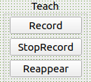
  

* 发送协议为
  | data[0] | data[1] | data[2] | data[3] |    Operation   |
  |  :---:  |  :---:  |  :---:  |  :---:  |      :---:     |
  |  0x00   |  0x00   |   0x00  |   0x01  |      Record    |
  |  0x00   |  0x00   |   0x00  |   0x02  |   Stop Record  |
  |  0x00   |  0x00   |   0x00  |   0x03  |      Replay    |

### 特殊状态
* 初始姿态: 机械位置的初始姿态
* 使能失能(初始时为Enable, 点击后自动变为disable)
* 急停
* XYPlane(将2DPlane修改为XYPlane)
* Initial(将3DSpace修改为Initial, 指的是运动规划的初始姿态)

  

    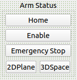
  

* 发送协议为
  | data[0] | data[1] | data[2] | data[3] |    Operation   |
  |  :---:  |  :---:  |  :---:  |  :---:  |      :---:     |
  |  0x00   |  0x00   |   0x00  |   0x04  |      Enable    |
  |  0x00   |  0x00   |   0x00  |   0x05  |     Disable    |
  |  0x00   |  0x00   |   0x00  |   0x06  | Emergency Stop |

  `Home`, `XYPlane`, `Initial` 三个按钮的协议使用[正运动](#protocol-forward-kinematics)的协议.
  * Home: J1~J6均为0, GP, GV, GF分别为0, 100, 20
  * XYPlane: J1~J6分别为某个固定值，暂定为0, 后续需要修改，GP, GV, GF分别为0, 100, 20
  * Initial: J1~J6分别为某个固定值，暂定为0, 后续需要修改，GP, GV, GF分别为0, 100, 20

## 机械臂状态显示
使用OpenGl显示机械臂的目标位姿和机械臂的反馈位姿，其中不透明的机械臂为目标位姿，透明的机械臂为通过TCP服务器反馈得到的反馈位姿
  

    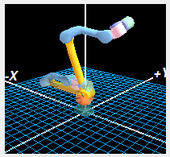
  

  

    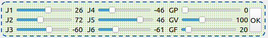
  

反馈协议同发送协议正运动学的协议

  | data[0] | data[1] | data[2] | data[3] | data[4] | data[5] | data[6] |
  |  :---:  |  :---:  |  :---:  |  :---:  |  :---:  |  :---:  |  :---:  |
  | 1145(head) |  joint1 |  joint2 |  joint3 |  joint4 |  joint5 |  joint6 |

## 相机图像显示
  

    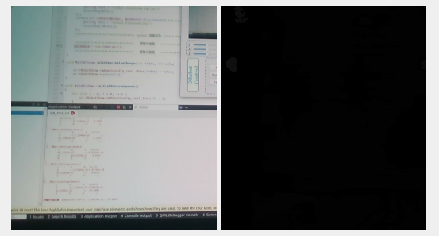
  

  图为Realsense D435i相机画面，后续可能会增加选择相机型号的功能

## 菜单栏
**Analyze**
* 在Analyse中添加两个Action, 分别为J1～J6的反馈(无需夹爪的反馈)和开发者模式
* J1~J6的反馈为读取50ms反馈一次的关节位置，可画成六幅波形图，接收协议为
  | data[0] | data[1] | data[2] | data[3] | data[4] | data[5] | data[6] | data[7] |
  |  :---:  |  :---:  |  :---:  |  :---:  |  :---:  |  :---:  |  :---:  | :---: |  
  | 1145(head) |  joint1 |  joint2 |  joint3 |  joint4 |  joint5 |  joint6 | 14(tail)

* 开发者模式功能如下图所示，用来设置六个joint的限位和零点设置(范围待定)
  

    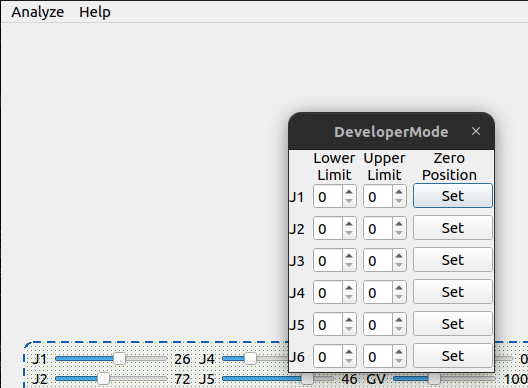
  

**Help**
* 版本信息及版权所有
  
  

    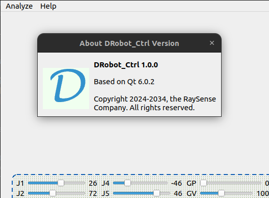
  

* 更新固件: github链接(暂时不放)
  
## 其他功能
* 页面缩放功能
* 新增选择机械臂类型选项，根据不同的选择，在右下方机械臂显示上显示不同的机械臂模型(暂时只有这一款，另一款等结构出图再定)，具体在哪里添加这个选项由UI设计决定
* 当相机未连接时，在右侧中间提示框中提示无相机连接，而不是整个报错上位机不显示，后期可能要添加其他相机类型(USB相机等)，需要自动识别相机类型或手动选择相机类型
<!-- ---
Ref: https://github.com/Ding-Kaiyue/DRobot_Ctrl.git -->